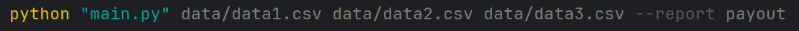

# Employee Salary Report Generator

## Описание

Этот проект представляет собой простой скрипт на Python для чтения данных сотрудников из CSV-файлов и формирования отчётов по заработной плате.  
Скрипт поддерживает передачу нескольких файлов с разными форматами колонок и позволяет выбирать тип отчёта через параметр командной строки.

---

## Возможности

- Чтение данных из одного или нескольких CSV-файлов с разными вариантами названий колонки ставки (`hourly_rate`, `rate`, `salary`).
- Формирование отчёта по зарплатам (`payout`), который группирует сотрудников по отделам и показывает выплаты.
- Легко расширяемая архитектура для добавления новых типов отчётов.
- Парсинг CSV реализован вручную без использования сторонних библиотек.
- Вывод отчёта в читаемом виде в консоль
- Покрытие кода тестами на `pytest`.

---

## Требования

- Python 3.6 и выше.
- Для запуска тестов: `pytest` (устанавливается отдельно).

---

## Установка

Клонируйте репозиторий и перейдите в каталог проекта:
```bash
git clone https://github.com/your-org/salary-reports-cli.git
cd salary-reports-cli
pip install -r requirements.txt
```
---

## Использование

Запуск скрипта с передачей одного или нескольких CSV-файлов и указанием типа отчёта:



## Аргументы

- `data1.csv`, `data2.csv` - пути к CSV-файлам с данными сотрудников.
- `--report payout` - тип отчёта (на данный момент поддерживается только `payout`).

---

## Формат входных данных

CSV-файлы должны содержать данные сотрудников с следующими полями:

- `id` (необязательно)
- `email` (необязательно)
- `name` - имя сотрудника
- `department` - отдел
- `hours_worked` - количество отработанных часов
- `hourly_rate`, `rate` или `salary` - ставка оплаты (название колонки может варьироваться)

Пример:
```
id,email,name,department,hours_worked,hourly_rate
1,alice@example.com,Alice Johnson,Marketing,160,50
2,bob@example.com,Bob Smith,Design,150,40
3,carol@example.com,Carol Williams,Design,170,60
```
---
## Пример отчета


---

## Структура проекта
```
├── main.py # Точка входа в программу
├── file_reader.py # Модуль для чтения и нормализации CSV-файлов
├── reports/
│ ├── base_report.py # Базовый класс отчёта
│ └── payout_report.py # Отчёт по зарплатам (payout)
├── tests/
│ ├── test_file_reader.py
│ ├── test_base_report.py
│ └── test_payout_report.py
└── README.md # Документация проекта
```
---

## Тестирование

Для запуска тестов установите `pytest`, если он не установлен:
```pip install pytest```

Для проверки покрытия:
```pytest --cov=.```

---

## Расширение

Для добавления нового типа отчёта:

1. Создайте новый класс отчёта, наследующийся от `BaseReport`.
2. Реализуйте методы `generate`, `format_row`, `department_summary` по необходимости.
3. Зарегистрируйте новый отчёт в словаре `REPORTS` в `main.py`.

---
